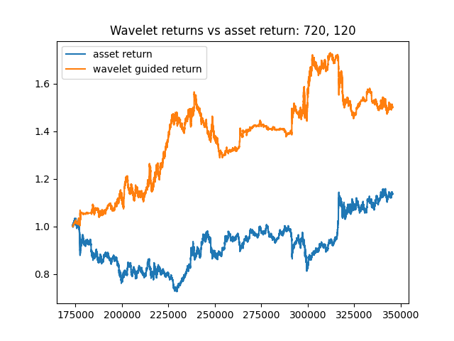

# wavelets_STP

This is an attempt to use wavelet coefficients obtained from discrete wavelet transform (DWT) and wavelet packets (WPT) as engineered features on stock trend prediction (STP). This project is inspired by [Multi-scale Two-way Deep Neural Network](https://www.ijcai.org/Proceedings/2020/0628.pdf).

Example: For the next 120 days, use XGBoost classifier on the previous 720 days

  

## Data Digestion

- **data/510050_1m.csv**: minute quote of 510050, a major index in mainland China, from 2015 to 2020. Each row contains date, time, open, close, high, low, and trade volume.

## File Digestion

- **preprocess.py**: standardize each column and obtain their wavelet coefficients; assign 0, 1, and 2 to each row as stock trend label. (0 for a decreasing trend, 1 for stationarity, and 2 for an increasing trend)
- **train_test.py**: fit a couple of classic ML models and track their accuracies;
- **naive_trading.py**: develop a simple long short trading strategy using the model with the best accuracy, and report some metrics on the strategies (annualized return, Sharpe Ratio, Calmar Ratio, maximum drawdown, and etc...)

## For developer: Notes after Meeting with Professor Alex Cloninger

Date: 2021/05/24

1. Interpretability:
   1. Add wavelet functions back to obtain the denoised sequence and compare;
   2. Visualize coefficients on a tree structure;
   3. Try sparse component analysis/nonnegative matrix factorization
2. Use validation set more often: pick the best performing parameters on validation set and look at performance on the upcoming testing set.
3. Presentable project style: [Documenting your projects on GitHub](https://guides.github.com/features/wikis/)
4. Change starting point for 720/120; visualize confusion matrix at each period.

## Technical issues

If XGBoost yields a segmentation fault, this could be resolved by uninstalling numpy, scipy, scikit-learn, XGBoost, and then only install XGBoost and scikit-learn.
